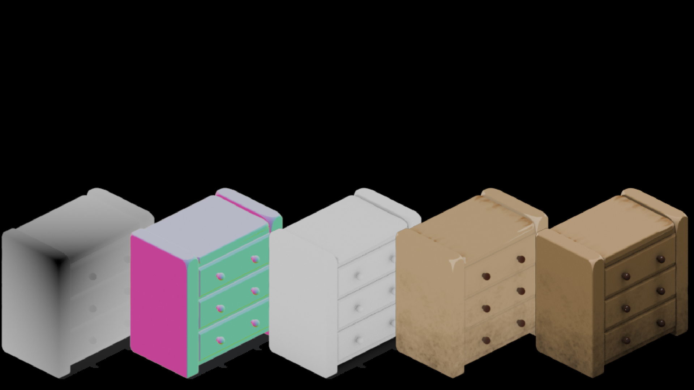

I’m experimenting with a 3D approach to tile creation, which could actually apply to a broader range of tasks.

The goal is to make the whole process more procedural—so that manual work is minimal, 
mostly just tweaking some sliders. 
Right now, all the textures are procedural, generated with a random seed.

I’m also adding different render layers like depth, shadow, normals, etc. It’s a bit more than strictly necessary, 
but I’m curious whether it could eventually allow 2D tiles to be lit by dynamic light sources 🌝.

